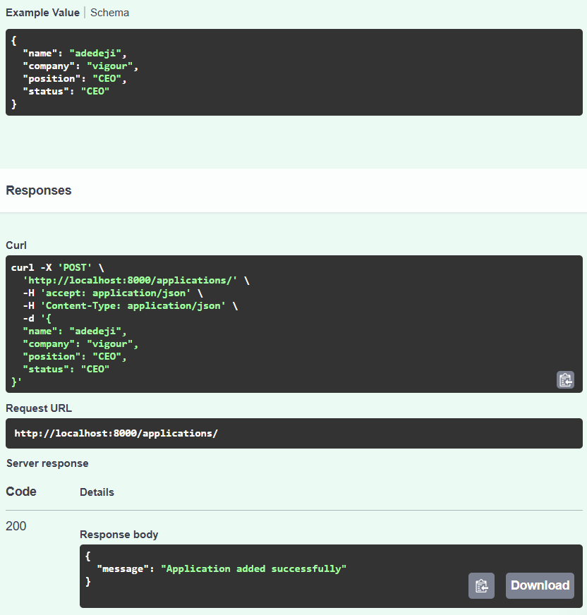
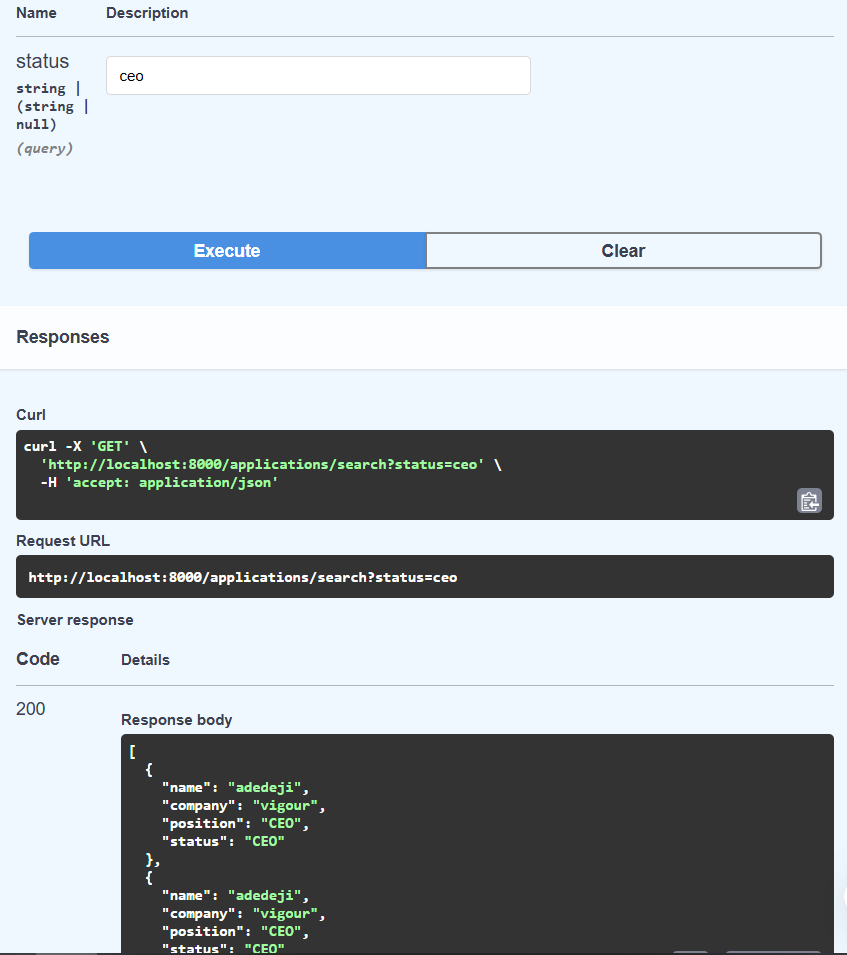

# Job Application Tracker API

This FastAPI project allows you to manage and search job applications.

## Features

- Add new job applications
- Retrieve all applications
- Search applications by status

## Endpoints

- `POST /applications/` - Add a new job application
- `GET /applications/` - Get all job applications
- `GET /applications/search?status=pending` - Search applications by status

## Files

- `main.py` - API logic
- `file_handler.py` - Handles file storage and retrieval
- `applications.json` - JSON file where application data is saved
- `requirements.txt` - Project dependencies

## Setup

```bash
pip install -r requirements.txt
uvicorn main:app --reload
```
## Screenshots




