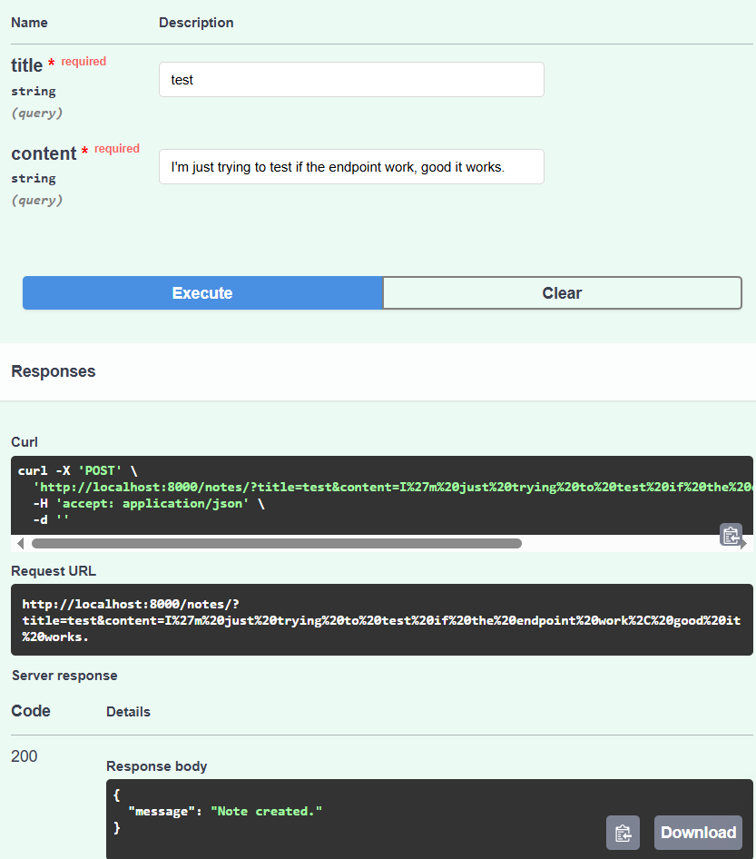
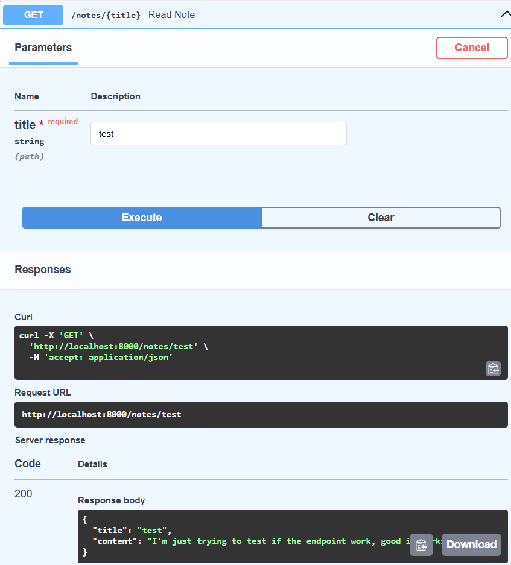
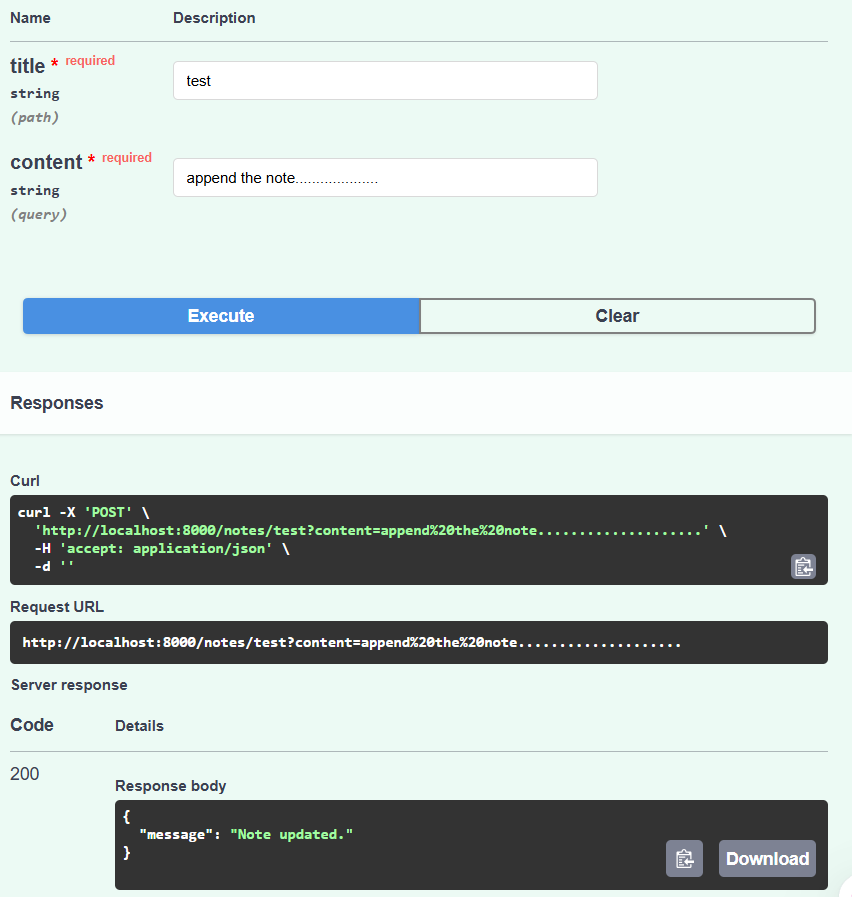
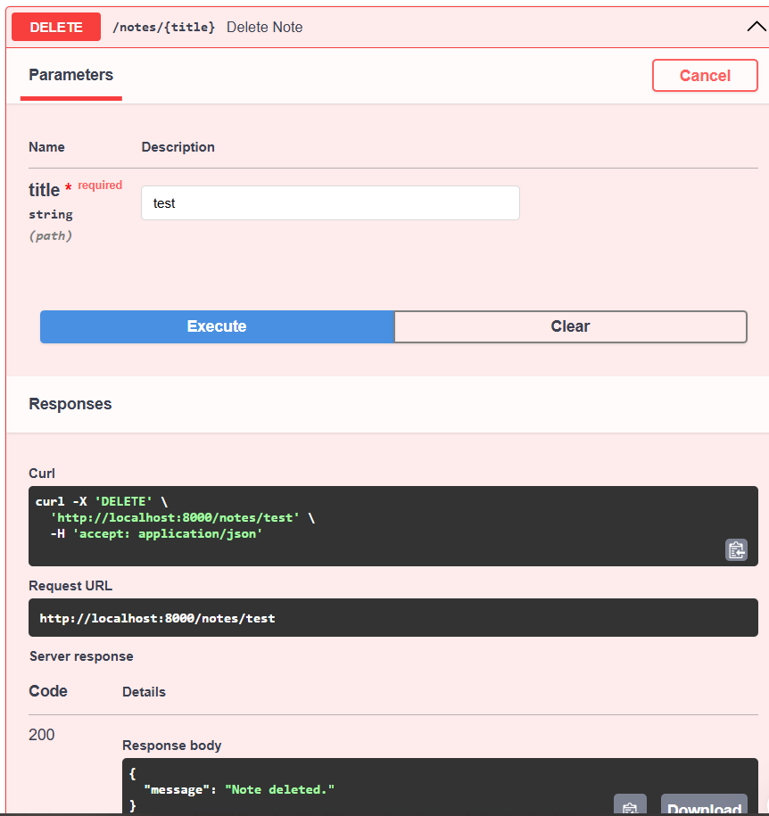

# Notes App API

This FastAPI app allows you to add, update, read, and delete notes stored as `.txt` files.

## Endpoints

- `POST /notes/` — Create note (title & content as query params)
- `GET /notes/{title}` — Read note
- `POST /notes/{title}` — Update note
- `DELETE /notes/{title}` — Delete note

## Setup

```bash
pip install -r requirements.txt
uvicorn main:app --reload
```
## Screenshots







