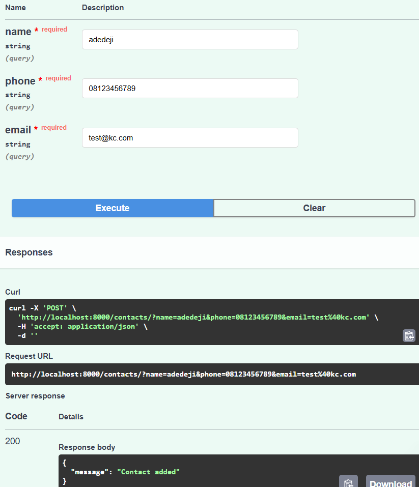
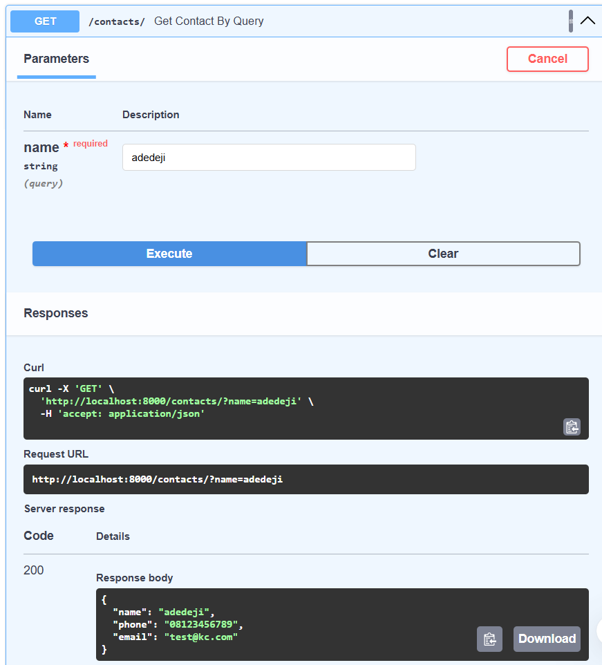
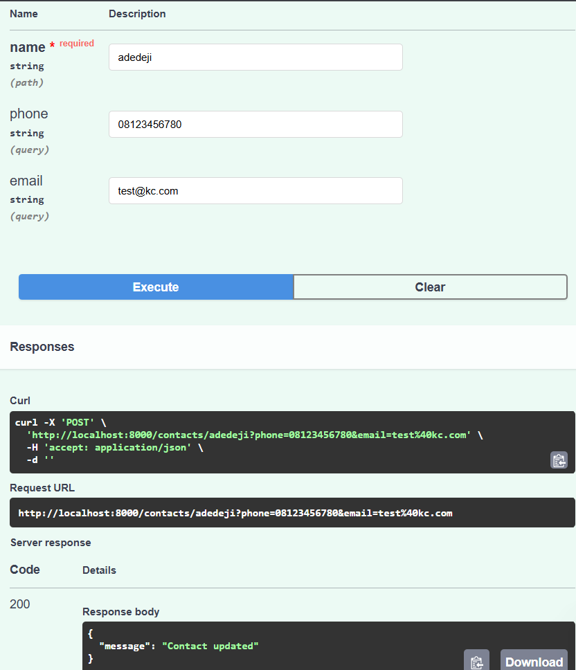
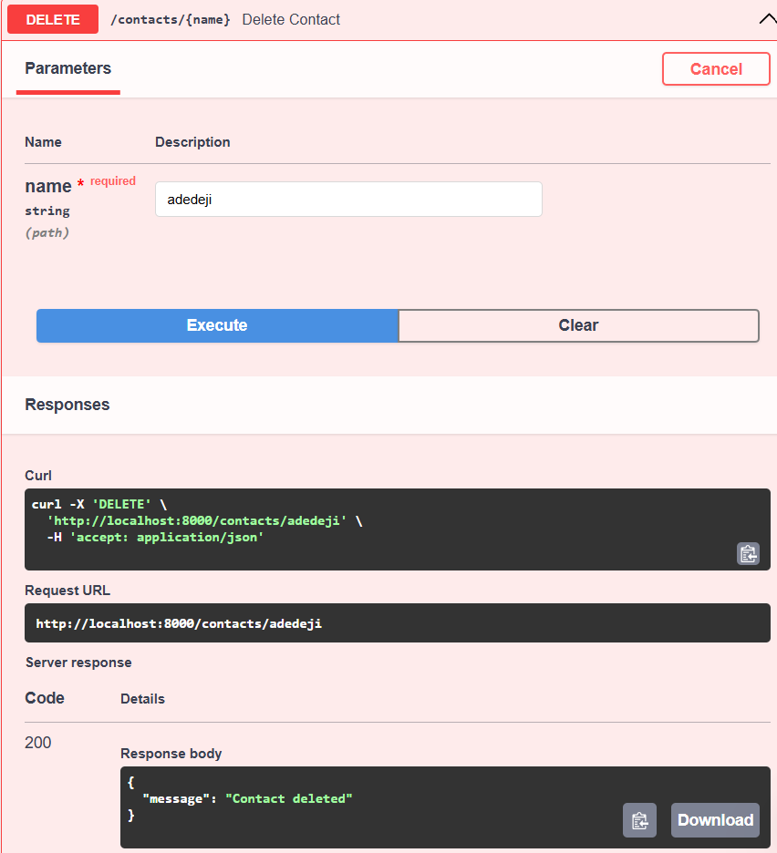

# Simple Contact API

This FastAPI app manages a contact list using path and query parameters.

## Endpoints

- `POST /contacts/` — Add contact
- `GET /contacts/?name=John` — Retrieve contact by name
- `POST /contacts/{name}` — Update contact
- `DELETE /contacts/{name}` — Delete contact

## Setup

```bash
pip install -r requirements.txt
uvicorn main:app --reload
```

## Screenshots








